# Knob reference

Every dial, what it does, what values it takes, and a demo of a
generation actually turning. Every demo's command is the recipe shown
beside or beneath it — the images are that command's output on the
fixed demo subjects;

Each flow has one demo stage, fixed for that section:

- **map-wal** paints [bango-renders-3d-abstract](assets/bango-renders-3d-abstract.webp)
  with Solarized Dark at `--harmonize 1` (the one-dial default:
  soft territory, reach 45, everything else stock). Per-knob demos vary
  only the knob named.
- **map-scheme** paints Rosé Pine Dawn with the hue families of
  [kelly-ishmael-butterfly-closeup](assets/kelly-ishmael-butterfly-closeup.webp)
  (below), also at defaults. The wallpaper is shown small because the
  scheme strip is the subject — the palette is what you are judging.
- **extraction** demos run `rehue inspect` on the butterfly.

<p></p>


Dials belong to **registers**: `bg` (base00), `surfaces` (base01-03),
`fg` (base04-07), `accents` (base08-0F) — a targeted flag writes the
named register's record, a bare flag seeds `all`. Per-register
`--config` records outrank the seeds; see
[Merge and precedence](#merge-and-precedence).

---

## map-wal (scheme → wallpaper)

Writes `wallpaper.png`, `compare.png` (before/after thumbnails),
`report.json` (per-slot pixel coverage). With all dials at zero the
output is a re-encoded passthrough.

### territory — `soft | hard`, default `soft`

| | |
| --- | --- |
| `soft` | every pixel's target is the palette's weighted mean under a smooth influence field (a Gaussian falloff on circular hue distance, lightness distance for achromatic pixels). Slot boundaries become smooth crossings; the flat-constant posterize look disappears by construction. |
| `hard` | nearest-slot snapping: pixels adopt exact palette colours and flat constants — the stylized, dithering-as-art mode. Both blend gates cut off at `reach-deg`. |

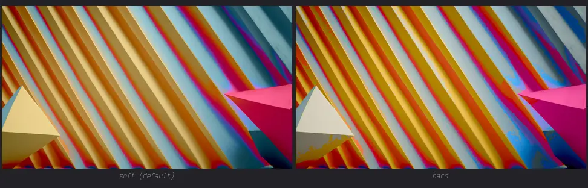

```sh
rehue map-wal --wallpaper pic.webp --scheme scheme.yaml --out out --territory hard
```

### harmonize — `0..1`, default `0`

The one-dial surface: seeds `blend-hue` and `blend-chroma` wherever
they are left unset. Explicit dials win (so `--harmonize 1
--blend-chroma 0.5` moves hue at full strength but chroma at half);
`blend-light` is never seeded — lightness stays photographic unless
you opt in by name.

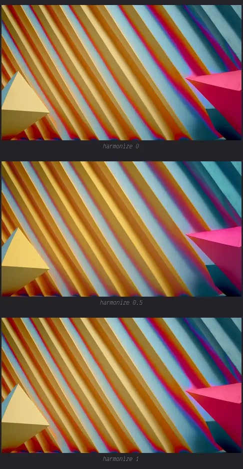

```sh
rehue map-wal --wallpaper pic.webp --scheme scheme.yaml --out out --harmonize 1
```

### blend-hue — `0..1`, default `0` (facade-seeded)

How far chromatic pixels' hue moves toward their influence-weighted
target: 0 = raw pixel hue, 1 = full adoption.

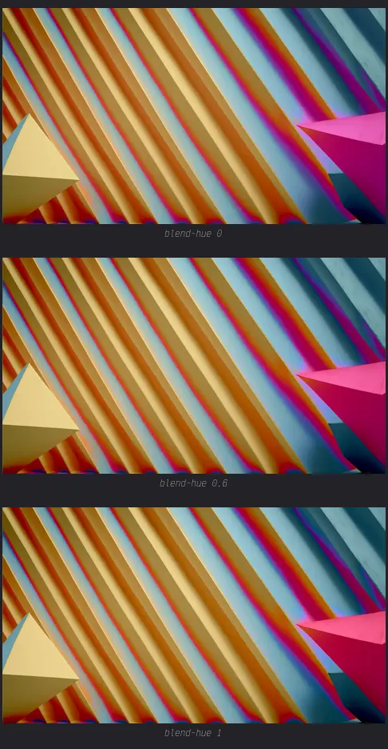

### blend-chroma — `0..1`, default `0` (facade-seeded)

How far chroma moves toward the target. This is the dial that carries
the "repaint" feel; harmonize seeds it along with blend-hue.

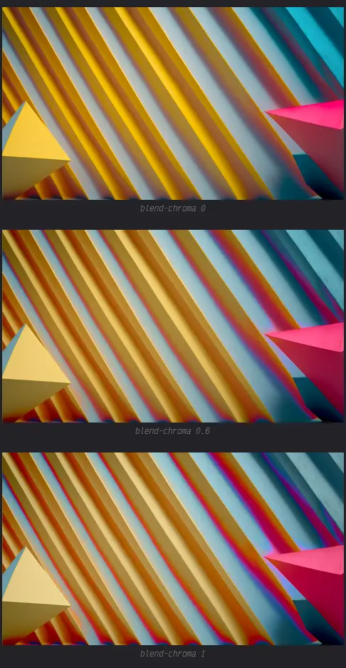

### blend-light — `0..1`, default `0`, decoupled

Lightness movement. Deliberately never facade-seeded: adopting
lightness flattens contrast and washes the image out — visible in the
ladder below at 0.5 and 1.0. Default 0 keeps the picture's own
lightness shape at every harmonize level.

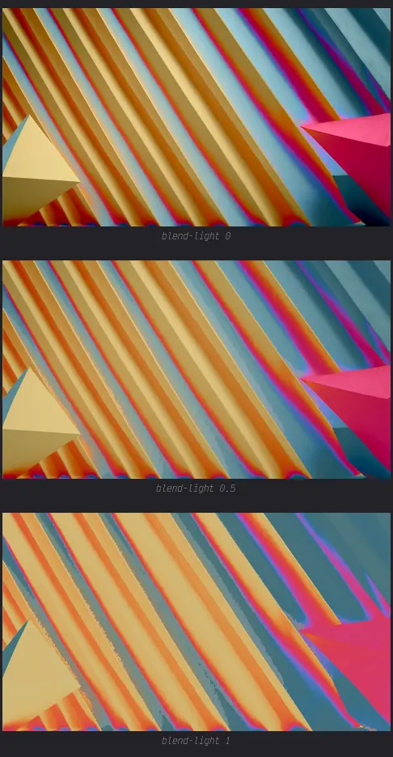

### reach-deg — degrees, default `45`

How far influence reaches on the hue wheel. In `soft` territory it is
the falloff width (larger = farther slots pull on each pixel); in
`hard` it is the cutoff both blend gates use.

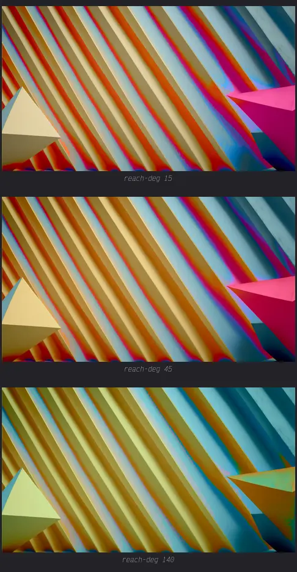

### gray-chroma-floor — default `0.02`

Chroma below which pixels count as achromatic: they key to the
scheme's low-chroma slots by lightness and **keep their raw hue
unconditionally** (blend-hue never touches them). Rising the floor
pulls pale pixels into the repainting earlier.

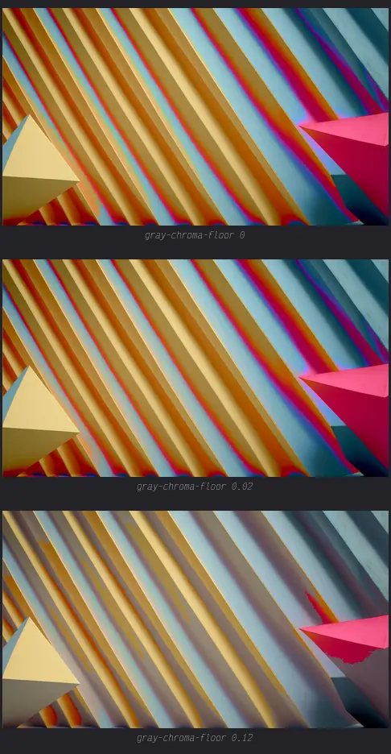

### dithering — `0..1`, default `0`

Strength of the dither. Inert at zero adoption (no residual to spread)
and at full adoption (the target swallows the residual) — it exists
for the partial-adopt and hard-territory looks.

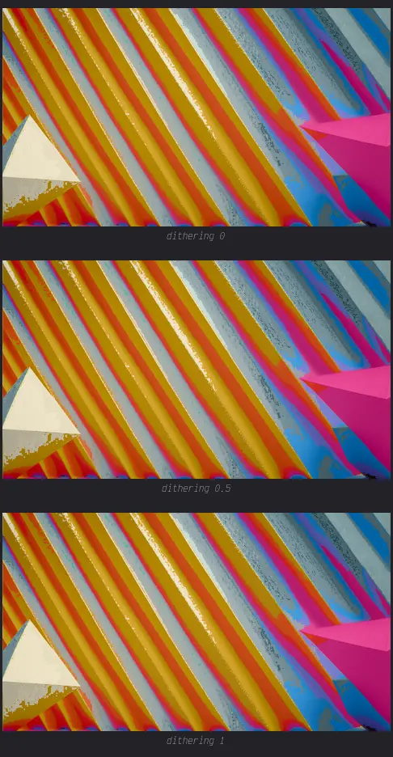

### dithering-mode — `blue-noise` (default) | `bayer` | `floyd-steinberg` | `atkinson` | `none`

The kernel the strength applies to: two ordered masks (void-and-cluster
blue noise, classic 8×8 Bayer) and two error-diffusion kernels
(serpentine scan, fixed order — no RNG). Floyd-Steinberg propagates
everything; Atkinson drops 2/8, which reads gentler.

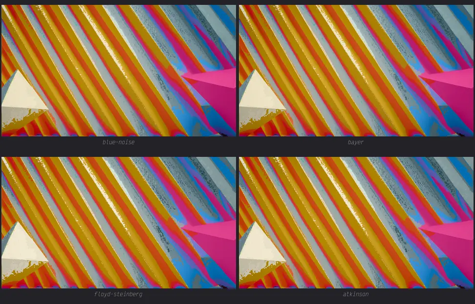

### distribution — per register

Arrangement: recolours the register's slots with the wallpaper's hue
families (lightness/chroma stay slot-local). Values, JSON syntax:
`true` = weight-ordered ramp across the register's span, `3` = pin to
family 3, `[0,1,2,3]` = explicit stops (duplicates give flat runs).
Family indices come from `rehue inspect`. Bare (untargeted): pin-only —
`bg` is single-slot and inherits the seed, so ramps need a target.

![accents: plain, stops [0,1,2,3], stops + rotate 1](assets/examples/knobs/wal-distribution.webp)

```sh
rehue map-wal --wallpaper pic.webp --scheme scheme.yaml --out out \
  --distribution accents '[0,1,2,3]' --rotate accents 1
```

### rotate — per register, integer

Shifts the register's assigned hues across its slots, `1` = one slot
right with wrap-around; no-op for single-slot registers. Composes
after distribution. Shown as the third cell of the demo above.

### light / chroma — two depths

Bare: the **image-wide** grade, applied last (additive L / multiplicative C).
Targeted (`--light bg -0.05`): that register's tonal grade, applied
before the image-wide one.

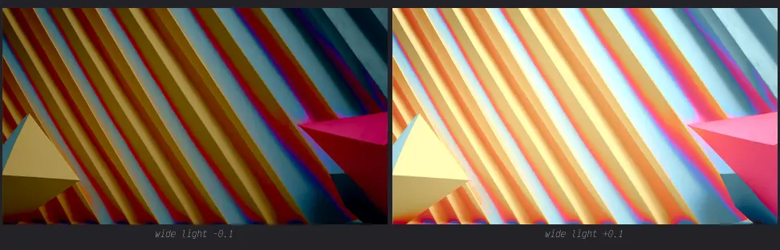

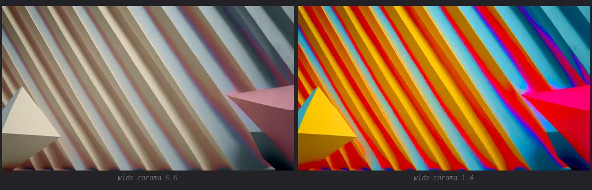

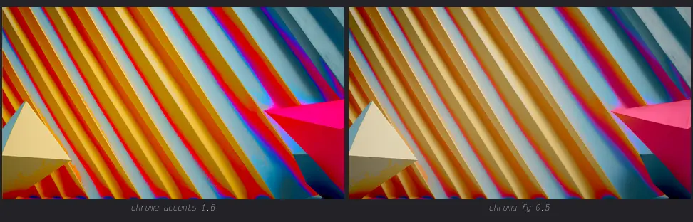

---

## map-scheme (wallpaper → scheme)

Writes `scheme.yaml`, `preview.png` (before/after swatches — the
strips below are exactly this artifact), `clusters.json` (extracted
families + params). The demo stage: butterfly → Rosé Pine Dawn.

### blend-hue — `0..1`, default `1`

The whole point of map-scheme: 1 = every slot adopts the mapped hue,
0 = the reference scheme verbatim. Between: the wallpaper's pull fades.
(Note the direction difference from map-wal: there blend-hue pulls
pixels *toward the scheme*; here slots pull *toward the wallpaper*.)

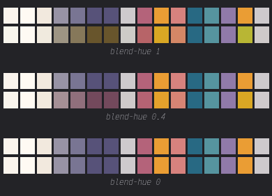

```sh
rehue map-scheme --wallpaper pic.webp --scheme rose-pine-dawn.yaml --out out \
  --blend-hue accents 0.4
```

### distribution — per register

Replaces the default assignment (accents claim eligible families by
hue distance; every other register adopts the heaviest family) with
explicit family targeting — same `true` / pin / stops vocabulary as
map-wal, over the accent claim behaviour.

![butterfly: defaults, accents [0,1,2,3], surfaces+fg ramp](assets/examples/knobs/scheme-distribution.png)

### rotate — per register, integer

Composes after assignment/distribution; the ramp permutes across the
register's slots.

![accents with distribution [0,1,2,3] at rotate 0 / 1 / 3](assets/examples/knobs/scheme-rotate.png)

### light / chroma — per register

Adaptive lightness/chroma shift (additive L, multiplicative C) applied
to the register's slots — the scheme's structure stays unless you ask.

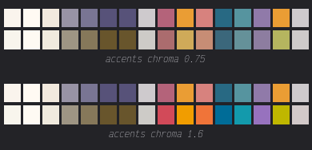

### reach-deg — degrees, default `45`

The accent claim gate: how far a family hue may sit from an accent
slot's hue and still claim it. Widening lets more slots follow more
families; narrowing forces them back to the heaviest ones.

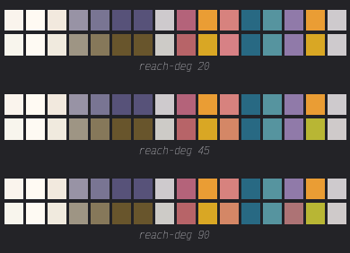

---

## Extraction

The extraction stage finds the wallpaper's hue families —
chroma²-weighted hue histogram, then a deterministic circular
k-means (greedy histogram seeding, fixed iteration count, no RNG). It
feeds map-scheme's mapping and map-wal's distribution; `rehue inspect`
prints its output as the index table (with `--out`, a swatch strip
whose positions are the indices).

| knob | default | semantics |
| --- | --- | --- |
| `image-max-dimension` | 256 | work at this capped resolution (bilinear-free Lanczos resize) |
| `chroma-pixel-floor` | 0.04 | ignore pixels below this chroma |
| `lightness-window` | [0.10, 0.92] | only pixels inside this L band vote |
| `max-hues` | 6 | at most this many families survive |
| `seed-separation-deg` | 25 | histogram seeding: minimum separation between seeds |
| `cluster-iterations` | 30 | fixed k-means iteration count |
| `merge-deg` | 18 | merge families closer than this |
| `min-cluster-weight` | 0.02 | drop families lighter than this mass |
| `accent-chroma-floor` | 0.06 | a family must be at least this chromatic to be claim-worthy by accents |
| `fg-contrast-floor` | 0.25 | legibility guard: restore fg-vs-bg contrast if graded below |

`max-hues` narrowing what survives, on the butterfly (2 / 4 / 6):

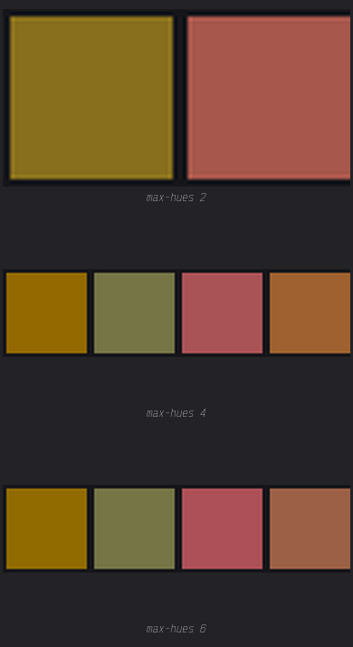

---

## Merge and precedence

Config records resolve `globals // all // register`: the CLI bare
flags seed `all`, targeted flags (`--chroma bg 1.6`) write the named
register record, and `--config` JSON records do the same job — with
one precedence rule per key:

1. per-register record (targeted flag or config file),
2. else the `all` seed (bare flag or config `all` record),
3. else the register's default.

Only map-wal's `--light`/`--chroma` bare form differs by design: it is
the image-wide grade, not a seed. Extraction knobs are config-JSON
only. Dithering is global-only: per-register records do not carry it.

The workshop example, expressed twice:

```sh
# flags form
rehue map-scheme --wallpaper pic.webp --scheme solarized-dark.yaml --out out \
  --blend-hue 1 \
  --chroma bg 1.6 --chroma surfaces 1.6 --chroma fg 1.6 --chroma accents 0.75 \
  --distribution bg 1 --distribution surfaces '[1,3]' --distribution fg 0 \
  --distribution accents '[0,1,2,3]'
```

```json
{ "registers": {
    "all": {"blend-hue": 1.0},
    "bg": {"distribution": 1, "chroma": 1.6},
    "surfaces": {"distribution": [1, 3], "chroma": 1.6},
    "fg": {"distribution": 0, "chroma": 1.6},
    "accents": {"distribution": [0, 1, 2, 3], "chroma": 0.75}
} }
```

Both run the same merge and the same engine; the JSON form wins when
the same dial needs the same value on several registers.