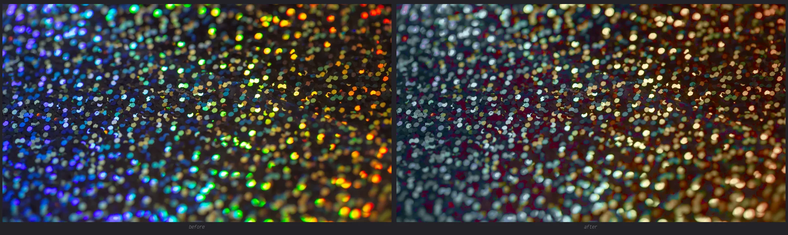
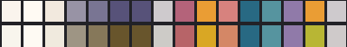
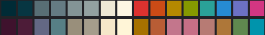
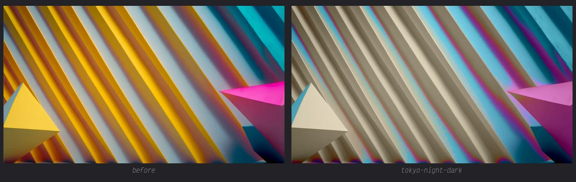

# rehue

*re-hue (verb): to color again differently.*

**rehue** maps **base16 color schemes and wallpapers onto each
other**: a terminal palette painted with your wallpaper's hues, or a
wallpaper repainted with the palette your terminal uses. Deterministic
and legibility-preserving, with the two outputs built to close back on
each other.

**`rehue map-scheme`** — scheme + wallpaper → scheme. It takes the *hues* from
your wallpaper and leaves everything that made the scheme readable
(lightness, chroma, contrast) exactly as a designer built it. The
palette feels like your wallpaper but behaves like the scheme.

**`rehue map-wal`** — wallpaper + scheme → wallpaper. The inverse. Any wallpaper,
any base16 scheme — the wallpaper comes back repainted with the
scheme's palette. No more hunting for that perfect wallpaper — the
picture you love is now the one that matches.

And using both together unlocks something interesting: the remapped scheme can
go straight back into the image — repaint the wallpaper with the palette
it generated itself.

## Why

Most wallpaper ↔ color scheme tools try to generate a palette from raw
image clusters, with no contrast guarantees — the results are
frequently muddy. rehue separates the two things a theming tool
actually needs: *which hues* come from the wallpaper, and *how the hues
are shaped* (lightness, chroma, contrast) comes from a scheme a
designer already built — Solarized, Gruvbox, Rosé Pine, any
[tinted-scheme](https://github.com/tinted-theming/schemes) YAML.

Guarantees, because a theme generator that can't be trusted is a
hobby, not a tool:

- **Deterministic** — no RNG anywhere (cluster seeding included); the
  same inputs produce byte-identical outputs.
- **Legibility preserving** — slots adopt the reference scheme's
  lightness/chroma and only change them through explicit dials; a guard
  restores fg-vs-bg contrast before rendering.

## Examples

All inputs are in-repo assets (CC0, see
[assets/attribution.md](assets/attribution.md)).

### Rainbow glitter → Gruvbox Light

One dial: `--harmonize 1`. The facade re-keys hue *and* chroma of
every pixel toward the palette; lightness stays photographic, so the
glitter keeps its sparkle and loses its rainbow.

```sh
rehue map-wal \
  --wallpaper assets/vidsplay-rainbow-glitter.webp \
  --scheme gruvbox-light \
  --out glitter \
  --harmonize 1
```



Coverage lands spread wide (the scheme's brightest surface carried 39%
of the pixels, the next slots in single digits) — one palette, still a
photograph.

### Rosé Pine Dawn → Butterfly

Defaults do the work: the butterfly's hues are extracted by
chroma-weighted mass and adopted slot by slot. Rosé Pine Dawn's
lightness, chroma and contrast carry through untouched.

```sh
rehue map-scheme \
  --wallpaper assets/kelly-ishmael-butterfly-closeup.webp \
  --scheme rose-pine-dawn \
  --out mapped
```




### The full round trip

Map-scheme first: paint Tokyo Night Dark with the hues of the
wallpaper — no options; blend-hue's default (1) adopts them in full:

```sh
rehue map-scheme \
  --wallpaper assets/bango-renders-3d-abstract.webp \
  --scheme tokyo-night-dark.yaml \
  --out mapped
```

Scheme before (top) / after (bottom) — tokyo night's structure kept,
only hues move:



Then feed it back into the image:

```sh
rehue map-wal \
  --wallpaper assets/bango-renders-3d-abstract.webp \
  --scheme mapped/scheme.yaml \
  --out repainted \
  --harmonize 1
```



The loop closed: the palette your terminal uses is now the palette the
picture was painted with.

## Setup

### With cargo

Plain cargo; the image codecs (png/jpeg/webp) are pure Rust — a stock
Rust toolchain is the only requirement. Requires 1.85 or newer
(edition 2024); rustup handles that automatically via
[`rust-toolchain.toml`](rust-toolchain.toml).
`cargo test` runs the test suite: snapshot and determinism checks.

```sh
git clone https://github.com/fortesoft-co/rehue
cd rehue
cargo install --path .          # installs the `rehue` binary
```

### With Nix

The flake exposes the package plus the builders for the nix wiring:

```nix
inputs.rehue.url = "github:fortesoft-co/rehue";
```

The devshell pins the same toolchain through Nix (`nix develop`).

## CLI

Five commands:

- `rehue map-scheme` — scheme + wallpaper → scheme
- `rehue map-wal` — wallpaper + scheme → wallpaper
- `rehue enhance` — a wallpaper upscaled: built-in Lanczos or vulkan AI SR
- `rehue inspect` — a wallpaper's hue families, or a scheme's slots, terminal-first
- `rehue schemes` — the embedded scheme names

Every command has a `--help` flag that prints its full option set:
each flag with what it does, the values it accepts, and an example
line; `-h` shows the short form.

### Basic usage

```sh
# map a reference scheme with a wallpaper's hues:
rehue map-scheme --wallpaper my-photo.jpg --scheme nord --out mapped
# mapped/scheme.yaml + preview.png + preview.html + clusters.json

# repaint a wallpaper with a scheme's palette:
rehue map-wal --wallpaper my-photo.jpg --scheme gruvbox-light --out repainted --harmonize 1

# or repaint with the scheme you just mapped (the full round trip is
# in Examples):
rehue map-wal --wallpaper my-photo.jpg --scheme mapped/scheme.yaml --out repainted
```

Both map flows print the palette as ANSI as they finish: map-scheme
shows the wallpaper's extracted families, then the reference and mapped
palettes; map-wal shows the reference palette and the arranged one that
painted the image. For dial-tweaking there is `--dry-run`: the previews
print, nothing is written (not even `--out` itself).

### --scheme

A scheme refers to a base16 color scheme, either as its name, or a yaml file containing the scheme.

The `--scheme` flag applies to map-wal, map-scheme, inspect. A scheme input is either a **name** or a **path**.

#### Bundled schemes

`--scheme` can be called with any of the schemes from tinted theming.
The [tinted theming](https://github.com/tinted-theming/schemes) repo provides 
a collection of 361 base16 schemes. 

Use `rehue schemes` to print the list.

#### Bring your own bundle

If you have your own directory of schemes, you can use `--scheme-dir` to
override the defaults to use your own names; a scheme name looks up in
that directory **before** the embedded collection.

### inspect

Inspect is used to show the colors used in a scheme or wallpaper.
By default it prints the colors to the terminal; with `--out DIR`,
families mode writes `inspect.png` (the swatch strip) and scheme mode
writes `preview.html` (the same mock page `map-scheme` emits).

Inspect has two modes.

**Families** — index a wallpaper's hue families: the `[i]` indices
that distribution configs target, with hue, chroma and weight per
family — plus a truecolor swatch row whose positions match the
printed indices:

```
rehue inspect --wallpaper butterfly.webp
```

**Scheme** — show a scheme's colors in the terminal: all 16 slots as
truecolor swatches, four per line, in canonical order:

```sh
rehue inspect --scheme gruvbox-light      # by collection name
rehue inspect --scheme my-theme.yaml      # by path
rehue inspect --scheme gruvbox-light --out inspect   # also writes preview.html
```

## Color Mapping

The mental model is two directions of the same move. 

**map-wal** pushes a picture's pixels toward the chosen palette: blend-hue and blend-chroma are movement dials, harmonize controls both at once. 

**map-scheme** pulls the palette toward the picture: its blend-hue adopts the wallpaper's hue families. 

The grammar's address term is the **register**. Colour dials belong to
groups — `bg` (base00), `surfaces` (base01-03), `fg` (base04-07),
`accents` (base08-0F) — so each dial lands where a desktop theme
lives.

Addressing is one rule deep: a bare dial flag sets the global seed
(`--chroma 1.2`), a dial with a register targets that group
(`--chroma accents 1.6`), and per-register records outrank the seeds —
whether from targeted flags or config records; targeted flags repeat
per register.

Every dial is opt-in; absent config is the sane default, and an `all`
record seeds every register. 

To get a better idea of how this works and what each dial does, the
visual demos and merge semantics live in [EXAMPLES.md](EXAMPLES.md).

### Shared dials (arrangement, both flows)

| option | semantics |
| --- | --- |
| `distribution` | hue-family adoption (JSON syntax: `true` = ramp, `3` = pin, `[0,1,2,3]` = stops) |
| `rotate` | rotate the register's hues across its slots (`1` = one right, wraps) |

### map-scheme (wallpaper → scheme)

| option | semantics |
| --- | --- |
| `blend-hue` | hue adoption from the wallpaper, 0..1 (default 1) |
| `reach-deg` | accent claim gate in hue degrees (default 45) |
| `light` / `chroma` | additive lightness shift / multiplicative chroma ratio, per register |

Extraction (`map-scheme --config` / `rehue inspect --config`):
`image-max-dimension`, `chroma-pixel-floor`, `lightness-window`,
`max-hues`, `seed-separation-deg`, `cluster-iterations`, `merge-deg`,
`min-cluster-weight`, `accent-chroma-floor`, `fg-contrast-floor`.

### map-wal (scheme → wallpaper)

| option | semantics |
| --- | --- |
| `territory` | how pixels see the palette: `soft` influence field (default) / `hard` flat-constant snapping |
| `harmonize` | one-dial facade: seeds `blend-hue` + `blend-chroma` where unset (default 0) |
| `blend-hue` / `blend-chroma` | hue / chroma movement toward the palette (0 = raw pixel, 1 = full snap) |
| `blend-light` | lightness movement, default 0 — photographic |
| `reach-deg` | influence reach in hue degrees (default 45) |
| `gray-chroma-floor` | achromatic threshold (default 0.02) |
| `dithering` / `dithering-mode` | dithering strength 0..1 (0 off) / kernel (default blue-noise) |
| `light` / `chroma` | image-wide grade, applied last (additive L, multiplicative C) |

### Stylix wiring (nix)

The nix builders are four lines around it: the remapped palette feeds
`stylix.base16Scheme`, the repainted wallpaper feeds `stylix.image`,
and GTK/Firefox/Zed/terminals/GNOME all restyle from one store path.
Every builder's output is a plain store path: the colour work happens
inside the build sandbox (nothing reads global config state, nothing
calls out), and the results — a scheme YAML, a PNG, the extraction
report — commit and diff like the rest of your config. The loop
closed: divergence between the scheme and the picture it came from
becomes structurally impossible.

```nix
# in a module:
let
  mapped = rehue.lib.${system}.mapScheme {
    wallpaper = ./assets/glitter.webp;
    scheme = "${pkgs.base16-schemes}/share/themes/gruvbox-light.yaml";
    # registers = { fg = { blend-hue = 0.4; chroma = 0.85; }; };
  };
  repainted = rehue.lib.${system}.mapWal {
    wallpaper = ./assets/glitter.webp;
    scheme = "${mapped}/scheme.yaml";
    config = { harmonize = 1.0; };
  };
in {
  stylix.base16Scheme = "${mapped}/scheme.yaml";
  stylix.image = "${repainted}/wallpaper.png";
}
```

## Repository

```
src/color.rs     sRGB/OKLab/OKLCH + circular-hue math (one source of truth)
src/scheme.rs    base16 YAML parse/render + slot access + name resolution
src/extract.rs   chroma^2 hue histogram + deterministic circular k-means
src/register.rs  map-scheme: the register pipeline and its options
src/map_wal.rs   map-wal: per-pixel blend/grade + territory + dithering
src/terminal.rs  truecolor ANSI strips for inspect (scheme + families modes)
src/enhance.rs   enhance: Lanczos + vulkan SR (realesrgan-ncnn-vulkan)
src/preview.rs   the compiled-in preview.html (css-only views; gtk/qt mocks)
src/bluenoise.rs embedded 64x64 void-and-cluster mask (CC0)
src/bin/rehue.rs the CLI
tests/           per-surface suites: extraction, map_scheme, map_wal,
                 scheme, terminal, enhance, preview, cli (+ common/ helpers)
```

## Development

```sh
# with your rustup toolchain:
cargo test
cargo build --release

# with Nix (pinned toolchain):
nix develop -c cargo test
nix develop -c cargo build --release
nix build .#rehue
```

Both paths are equivalent; `rust-toolchain.toml` pins the toolchain for
rustup users, the devshell does the same through Nix.

## Roadmap

- **ADVANCED_EXAMPLES.md** — the complex combinations that stay out of
  the main docs (distribution sculpting across registers, reach
  tuning, the colorize recipes), each with receipts.
- **UI previews** — demo renders of the scheme applied to real
  surfaces: a terminal, a code block, a web page, GTK and Qt widgets,
  so a scheme can be judged before it's wired in.
- **Extraction tuning** — the extraction options documented as their own
  surface, optionally backed by alternative extraction libraries.
- **Enhance expansion** — v1 (Lanczos + vulkan SR) lives in
  `enhance`; the dials beyond it: denoise / de-jpeg restoration models
  (Real-CUGAN / realesrnet), a low-strength img2img restyle (sd.cpp) as
  a creative pass, and an opt-in nix SR builder (lavapipe for the
  driver-less path).
- **Perf tuning** — the per-pixel map-wal pass is single-threaded;
  non-dithered and ordered-dither modes shard cleanly (pure functions
  of x, y), pulling a 33MP remap from ~18s toward ~2-3s; the
  error-diffusion modes stay sequential by nature.
- **Scheme generation** — the big one: derive the lightness/chroma
  structure a designer would have built, guided by the wallpaper —
  map-scheme without needing a reference scheme at all.
- **base24 coverage** — base10-17 slots.

## License

AGPL-3.0-or-later - see [LICENSE](LICENSE).
