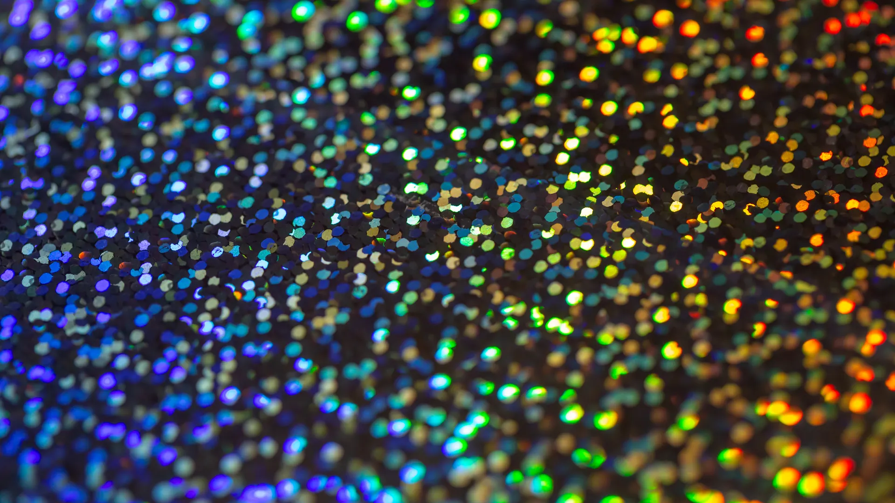
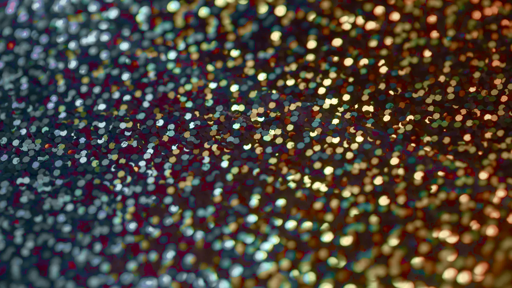
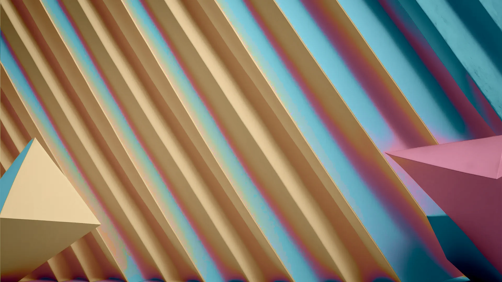

# scratch: visual working notes

## rainbow glitter -> gruvbox light (map-wal, one dial)

Facade only: `{"harmonize": 1.0}` — seeds `blend-hue` and `blend-chroma`
at 1.0; `blend-light` stays decoupled at 0 (photographic), territory
`soft` (default), `reach-deg` 45 (default), dithering off.

```
rehue map-wal \
  --wallpaper assets/vidsplay-rainbow-glitter.webp \
  --scheme <schemes>/gruvbox-light.yaml \
  --out examples-test/glitter3/facade-1 \
  --config examples-test/glitter3/v02-facade.json
```

before:



after:



Coverage skewed bright: base07 39.1%, base06 10.8%, base0e 8.9%.
The glitter highlights land on the scheme's light surfaces; no single
slot swallows the image.

## bango round trip (map-scheme -> map-wal)

Same wallpaper both hops: bango renders 3d-abstract. First
map-scheme paints solarized-dark with the wallpaper's hue families
(inspect: [0] 84.7 olive 63%, [1] 347.5 magenta 17%, [2] 43.4 orange
13%, [3] 207.9 blue 4%, [4] 235.8 3%) — with distribution + the
chroma-visibility aid:

```json
{
  "registers": {
    "all": {"blend-hue": 1.0},
    "bg": {"distribution": 1, "chroma": 1.6},
    "surfaces": {"distribution": [1, 3], "chroma": 1.6},
    "fg": {"distribution": 0, "chroma": 1.6},
    "accents": {"distribution": [0, 1, 2, 3], "chroma": 0.75}
  }
}
```

```
rehue map-scheme \
  --wallpaper assets/bango-renders-3d-abstract.webp \
  --scheme <schemes>/solarized-dark.yaml \
  --out examples-test/bango2/scheme-dist-vivid3 \
  --config examples-test/bango2/scheme-dist-vivid3.json
```

scheme before (top) / after (bottom) — solarized's structure kept,
only hues move; neutrals at chroma 1.6 so the hue rotation reads:


Then feed the mapped scheme back into the image:

```
rehue map-wal \
  --wallpaper assets/bango-renders-3d-abstract.webp \
  --scheme examples-test/bango2/scheme-dist-vivid3/scheme.yaml \
  --out examples-test/bango2/feed-back \
  --config examples-test/bango2/feedfacade.json
```

with the same one-dial facade (`{"harmonize": 1.0}`):



Closed loop: the wallpaper's hues claim scheme slots, then the image
is repainted toward its own re-derived palette. Coverage spread wide
(base0f 13.0%, base08 11.9%, base0d 11.8%) — the round trip doesn't
flatten the image into one family.